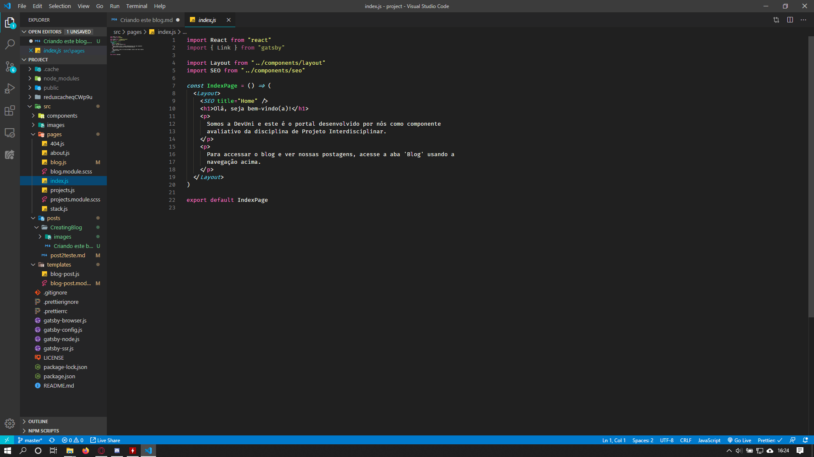
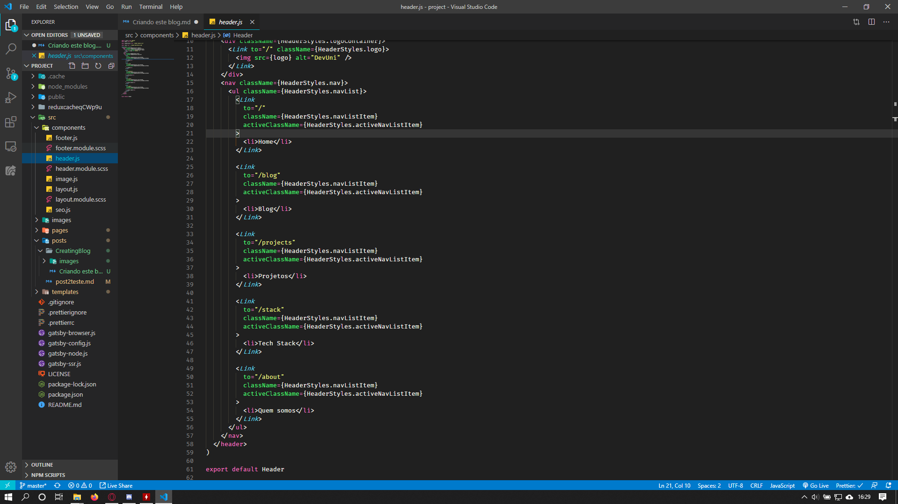
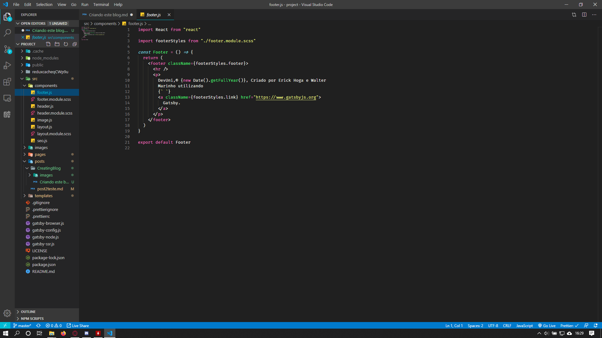
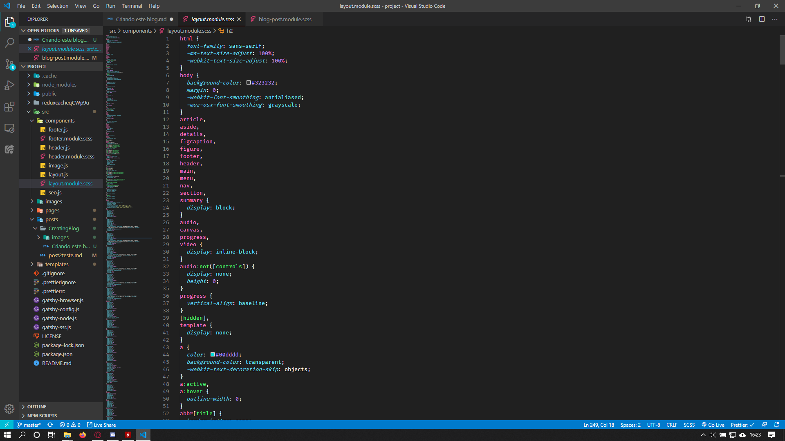

Olá a todos!

Sejam bem vindos ao primeiro post do blog! 

Aqui, eu gostaria de compartilhar com vocês uma parte do processo de criação deste blog.

Primeiramente, gostaria de ressaltar que é necessário conhecer os princípios de programação web em:   

1. HTML,    
2. CSS,     
3. Javascript.    

A partir disso, a documentação do Gatsby já supre bem as necessidades extras. A documentção está disponível em <https://www.gatsbyjs.org/docs/>.

Isso dito, vamos lá!

## 1. - Instalando Programas utilizados e criando site com o starter-template:

  Para fazer este site, utilizamos o Gatsby, um dos frameworks para criação de sites estáticos mais populares atualmente. Sua linguagem-base é o ReactJS, que por sua vez é uma biblioteca de código Javascript. Como dito pelo seus criadores, "uma biblioteca JavaScript declarativa, eficiente e flexível para a criação de interfaces de usuário (UI)".

  Então vamos lá, para instalar o Gatsby precisamos, num primeiro momento instalar o NodeJS, um interpretador de JavaScript. O baixamos [aqui.](https://nodejs.org/en/download/) Recomendo a versão LTS mesmo, é a que vai dar menos problemas.

  Após baixarmos, rodamos o arquivo .exe mesmo.

  Certo, na segunda etapa é instalamos o gatsby, para isso abrimos um terminal no computador e digitamos:

        # no terminal
        npm install -g gatsby-cli 

  Feito isso, o gatsby já foi instalado. Agora criamos o projeto. 

  Navegamos para a pasta onde quer criar o projeto, e digitamos no terminal:

        # no terminal
        gatsby new my-project-name https://github.com/gatsbyjs/gatsby-starter-default

  Pronto! O projeto foi criado na pasta com o nome que especificamos no campo "my-project-name" acima.

## 2. - Criando as páginas e estilizando-as:
  
  ### Criação de páginas
  Para o conteúdo do site, é necessário o conceito de 'JSX', o que ele representa é código XML renderizado em meio à código JavaScript. 

  
  
  Criamos componentes para o header e footer, com a navegação e o texto no fim do site.

  

  

  E então criamos os layouts das páginas presentes na navegação (Home, Blog, Projetos, Stack, Quem Somos). 

  ### Estilização geral

  A partir da estilização CSS fornecida pelo starter do Gatsby, customizamos as cores, posições e características gerais deste site, como o fundo cinza, a fonte, os detalhes de seleção, links, etc.

   

## 3. Adicionando conteúdo às páginas:

  Por fim, adicionamos os conteúdos às páginas, criamos este post e preenchemos os espaços com as respectivas informações, e estilizamos cada uma das páginas de forma isolada para suprir pequenas diferenças de design nas páginas, mas nada muito drástico para não sair da identidade visual do projeto.

  Pronto! Este foi um resumo de como foi feita a criação deste portfolio/blog. Se quiser mais informações recomendo visitar os links abaixo.

---

1. Códigos do projeto no repositório **[GitHub](https://github.com/walttsm/portfolio-PI2).**

2. **[Gatsby JS - The Great Gatsby Bootcamp [Full Tutorial]](https://youtu.be/8t0vNu2fCCM)** feito por Andrew Mead.

3. **[Documentação](https://www.gatsbyjs.org/docs/)** e **[Tutorial](https://www.gatsbyjs.org/tutorial/)** do GatsbyJS.
