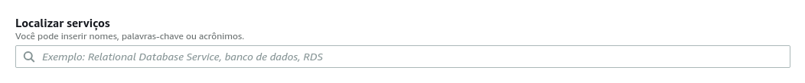

Olá leitor(a)!

Voltamos para mais um post no blog!

Desta vez vamos mostrar como criamos um web server para hospedar os arquivos deste site!

Para este caso, as configurações foram feitas num laptop com sistema Ubuntu e usamos os serviços da AWS, portanto, caso estiver utilizando outro sistema operacional e/ou plataforma de serviços, o processo será diferente...

Sem mais delongas, vamos lá!

# 1. Criando conta da AWS e acessando o painel de criação de server:

Caso já possua uma conta AWS, pode pular a criação de conta e logar normalmente. Senão execute os passos abaixo.

Primeiramente devemos criar uma conta AWS. Acesse <https://signin.aws.amazon.com/signin?redirect_uri=https%3A%2F%2Fportal.aws.amazon.com%2Fbilling%2Fsignup%2Fresume&client_id=signup> e clique em "Criar uma nova conta AWS. Preencha os dados e no final, clique em criar conta. O processo solicitará o fornecimento de cartão de crédito, mas todos os recursos usados e mostrados aqui estão disponíveis como gratuitos, pelo menos no período de escrita deste post.

Após criar sua conta, clique no painel de busca e pesquise "ec2". Ou procure na aba abaixo onde está escrito "Criar uma solução".




Você deve acessar uma pagina semelhante a abaixo:


# 2. Criando par de chaves de segurança SSH:

No painel lateral, acesse "Network & Security -> Key Pairs".

Clique em create new key pair e preencha com um nome para seu par de chaves. A recomendação de nome é o seu nome + key-pair + região do par de chaevs.

Você pode conferir a região ao qual está conectado ao lado do seu nome de usuário na barra de navegação da página.

Use o formato pem para usar SSH como meio de conexão. Caso estiver no windows e for utilizar putty é possível usar a outra opção.

clique em create key pair, baixe o arquivo gerado e salve-o em um local seguro.

# 3. Criando grupo de segurança com as regras de acesso:

Vamos então para a próxima etapa:

Na barra lateral, abaixo de "Network & Security", acesse Security Groups.

Clique em "Create new security group". Preencha os dados e adicione as regras de segurança ao final do formulário. O VPC pode permancecer com o valor padrão.

No meu caso, criei 5 regras, onde 4 servem para fornecer os dados para o browser do usuário (HTTP E HTTPS), e uma para nós acessarmos o servidor do nosso terminal na próxima etapa.

Ao final do texto deixarei links para guias da propria AWS para executar estas etapas, onde você pode conferir com mais detalhes como executar cada passo.

# 4. Criando o servidor

Na barra de navegação lateral, acesse a opção instances.


Aqui é onde você poderá ver todas as suas máquinas AWS EC2 rodando. Por enquanto, clique em Launch Instance.

Você será solicitado a selecionar o sistema operacional que irá usar no seu web server. No caso deste site, utilizei o "Ubuntu Server 18.04 LTS (HVM), SSD Volume Type". Todos os sistemas disponíveis sem custo adicional estão marcados como "Free tier eligible".


Depois de escolher os sistema, clique em select.

No tipo de instância, selecione t2.micro. e clique em review and launch.

Agora, navegue até a aba Security groups e acesse Edit security groups.


Selecione "Select an existing security group", e selecione o grupo gerado na etapa #3. Para, voltar clique novamente em review and launch.


Para finalizar clique em Launch. Uma solicitação de chave de segurança aparecerá, selecione o par de chaves criado na etapa #2. Caso a sua chave não apareça, verifique a região de conexão e caso, for diferente da região onde as chaves foram criadas, retorne e crie chaves para esta região ou tente criar a instância do server na mesma região das chaves.

Confirme que você tem acesso as chaves e clique em Launch instance. Você será direcionado à uma página de informações da instância, no fim da página, clique em View instances.

Sua instância deve aparecer na lista desta página. Aguarde alguns momentos para que a instância inicie, e assim que o status mudar para "running", prossiga para as proximas etapas.


Ao clicar na instância, você pode verificar as configurações dela no painel inferior. Este painel será útil na etapa seguinte.

# 5. Acessando a instância:

Muito bem, agora usaremos o terminal para acessar a nossa instância e controlá-la para tranformá-la num servidor web. Para um gui com imagens e mais detalhado, lembre de checar os links no fim do post.

Usaremos aqui o metodo SSH no Ubuntu! Caso esteja usando outro método o guia aqui não funcionará! Cuidado!

Caso não tenha um cliente ssh instalado em sua máquina, por favor instale algum.

Abra um terminal no seu computador e digite o seguinte comando:

```
    $ ssh -i <endereço do seu arquivo de chaves>.pem ubuntu@<endereço DNS público da sua máquina>
```

Para encontrar o endereço publico da sua máquina, consulte o painel inferior citado no fim da etapa anterior. Ele deve estar na opção Public DNS (IPv4).

O nome de máquina 'ubuntu' deve funcionar se a instância foi gerada conforme dito antes.

Se ao rodar o comando você deve ver algo como ubuntu@<IP privado da máquina> no terminal.

E pronto, este terminal é o capaz de controlar nossa instância remotamente.

# 6. Configurando o firewall da instância:

Como estamos usando o Ubuntu, nosso firewall será o ufw. Primeiro digite, no terminal da instância:

```
    $ sudo ufw status
```

O comando deverá retornar status: inactive. Precisamos configurá-lo e ativá-lo.

Vamos configurá-lo rodando estes comandos no terminal:

```
    $ sudo ufw default outbound allow outgoing
    $ sudo ufw default deny incoming
```

Para permitir o acesso da sua chave ssh, configure usando o seguinte comando:

```
    $ sudo ufw allow ssh
```

Para permitir acesso ao site:

```
    $ sudo ufw allow 80/tcp
```

Cheque as regras que acabou de adicionar usando 'sudo ufw status'.

Por fim, ative o firewall rodando:

```
    $ sudo ufw enable
```

Pronto! Firewall configurado!

# 7. Instalando web server apache2 (httpd):

Vamos fazer nossa máquina mostrar a pagina ao ser acessada.

Rode o comando no terminal na seginte ordem:

```
$ sudo apt update
$ sudo apt install apache2
```

Pronto! navege até a pasta '/etc' no terminal e digite ls para ver os arquivos na pasta. Caso a pasta 'apache2' esteja presente. O processo foi bem-sucedido.

Abra uma janela no navegador e digite o endereço IP publico da sua máquina (É possivel ver o endereço nos detalhes da instância no console AWS).

Uma página padrão deve aparecer para te assegurar que o server está rodando.

# 8. Movendo os arquivos do site:

Com os arquivos de build do seu site prontos, basta agora movê-los para a pasta /etc/www/html da sua instância.

Para isso usamos o filezilla. Deixarei um link para o site oficial no fim do post.

Transferidos os arquivos, basta reiniciar o apache2 com o comando:

```
\$ sudo service apache2 restart
```

O site deve estar no ar!

Obrigado por acompanhar e ler até aqui!, foi basicamente desta forma que criamos um máquina virtual e hospedamos nosso site para a segunda fase do projeto de PI 2! Abaixo estão os links de guias e consultas usados para esta fase!

#Guias mais detalhados e referências:

##**Etapas #2, 3 e 4:**
###Criando key pairs e Security groups:
<https://docs.aws.amazon.com/pt_br/AWSEC2/latest/UserGuide/get-set-up-for-amazon-ec2.html>
###Criando instância linux:
<https://docs.aws.amazon.com/pt_br/AWSEC2/latest/UserGuide/EC2_GetStarted.html>

##**Etapa #5:**
###Acessando instâncias:
<https://docs.aws.amazon.com/pt_br/AWSEC2/latest/UserGuide/AccessingInstances.html>
<https://docs.aws.amazon.com/pt_br/AWSEC2/latest/UserGuide/AccessingInstancesLinux.html>

##**Etapa 6:**
###Configurando o firewall da instância:
<https://www.cyberciti.biz/faq/how-to-setup-a-ufw-firewall-on-ubuntu-18-04-lts-server/>

##**Etapa #7:**
###Instalar e configurar o apache2:
<https://ubuntu.com/server/docs>
<https://ubuntu.com/server/docs/web-servers-apache>
<https://httpd.apache.org/docs/2.4/bind.html>

##**Etapa #8:**
###Transferindo arquivos para a instância:
<https://angus.readthedocs.io/en/2014/amazon/transfer-files-between-instance.html>
<https://filezilla-project.org/>
