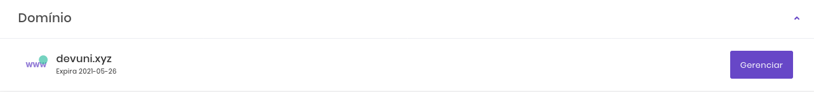
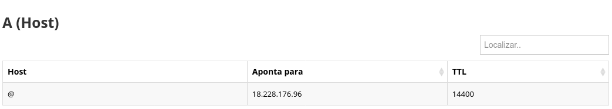
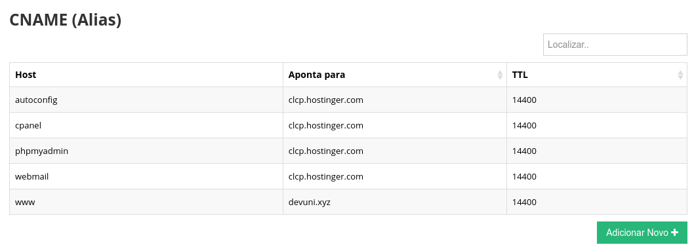
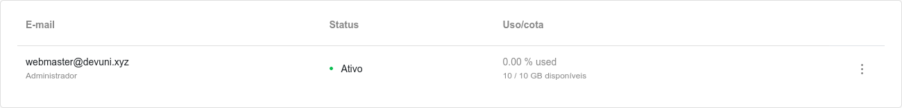
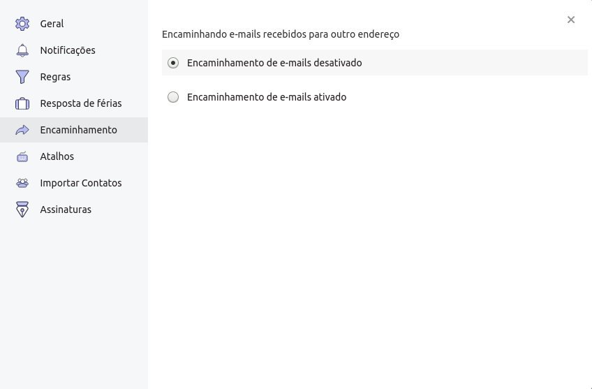

Olá de novo!

Voltamos para mostrar como conseguimos o domínio 'devuni.xyz' e o vinculamos para este site. Além disso, vamos configurar uma conta de emails para o domínio e redirecionar para outra conta de email.

# 1.Comprando o domínio

Procuramos em alguns sites como GoDaddy, NameCheap, Route 53 da AWS e outros por um nome de domínio que fosse fácil de lembrar e ao mesmo tempo fosse relativamente barato. Após as pesquisas encontramos o site 'Hostinger' e optamos por ele pois ficamos satisfeitos por encontrarmos o domínio '.xyz' com preço acessível.

Inclusive, aqui vai uma curiosidade, a Google anunciou que no futuro seus sites utilizarão o '.xyz' como domínio. Se você acessar <https://abc.xyz> poderá ver o site com a logo da google.

Após a compra do domínio, entramos no painel de usuário da hostinger e acessamos o painel de gerenciamento do nosso site clicando no botão 'Gerenciar'.

Em seguida, acessamos o painel zona DNS no painel superior da página.

Para vincular o nome 'devuni.xyz' ao servidor EC2 criado no post anterior, precisamos alterar a seção 'A(Host)' na configuração do nosso site. A forma mais simples de fazer isso é criar um host que aponta para o endereço IP público da nossa instância de servidor. Essa alteração geralmente demora 1 ou 2 horas para ter efeito, mas pode demorar até 48 horas. No fim esta configuração ficou como na imagem abaixo. O @ significa que o host é o próprio nome do domínio (devuni.xyz).

Agora adicionamos uma opção à seção 'CNAME (ALIAS)' para que, quando alguém acessar 'www.devuni.xyz', também acesse 'devuni.xyz' e, consequentemente receba do servidor o nosso site. Basta adicionar um novo alias com host 'www' e apontar para o nome de domínio.

Vale ressaltar que os outros alias foram criados automaticamente pelo sistema da Hostinger.

# 2. Criando email vinculado ao domínio

Como não hospedamos nosso site nos servidores da Hostinger (que fornece uma conta de e-mail de graça neste caso), para criar um serviço de email vinculado ao nosso domínio, contratamos o serviço de email com a Hostinger. Após a confirmação, acessamos o painel de configuração do serviço de e-mail e vinculamos nosso domínio à ele. Em seguida clicamos na opção 'novo email' e digitamos o username 'webmaster'. Isso gerou o e-mail 'webmaster@devuni.xyz como na imagem abaixo.

Em seguida acessamos a página de emails e fizemos o login com o email acima e a senha cadastrada no momento de criação. Para configurar o redirecionamento de e-mails, acessamos o painel de preferências do e-mail e acessamos a aba 'encaminhamento'. Selecionamos 'Encaminhamento de emails ativado e preenchemos com nosso email de preferência.

É isto que temos para este post caro leitor. Deixo abaixo alguns guias de documentação que foram de grande ajuda para esta etapa.

Até mais!

**Como Apontar o Nome de Domínio para a Hostinger (Atualização)**

<https://www.hostinger.com.br/tutoriais/como-apontar-o-nome-de-dominio-para-hostinger/>

**Como Criar um Email Profissional e Configurar Cliente de Email**

<https://www.hostinger.com.br/tutoriais/email-empresarial-como-criar>

**Como Posso redirecionar meu endereço de email?**

<https://www.hostinger.com.br/como/como-posso-redirecionar-meu-endereco-de-email>
