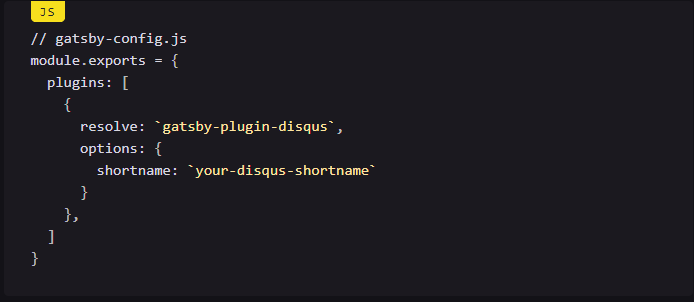
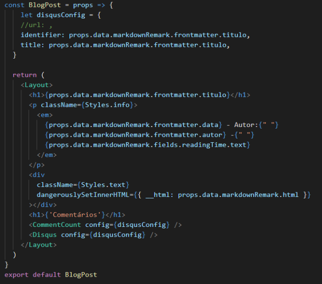

Utilizamos um plugin agora chamado Disqus para adicionar comentários a paginas do blog!

# Instalação

Primeiramente para instalamos o plugin do Disqus a partir do comando: npm install -S gatsby-plugin-disqus.

# Configuração e Conta no disqus

Acessando o site : https://help.disqus.com/ e criamos uma conta com shortname. Iremos usar este shortname para a configuração do plugin.
Alteramos o arquivo gatsby-config.js conforme a imagem abaixo:

substituimos o "your-disqus-shortname" com o shortname criado (pidevuni)

# Uso

Seguindo o tutorial, substituimos os campos identifier e title pelas variaveis de ambas e adicionamos no return o Disqus para assim aparecer o campo para comentar. Para maiores informações, consulte a referência ao fim do post.

Por fim, adicionamos nossos projetos pessoais na página de 'projetos' do site. Você pode acessá-la através da navegação ou através deste [link](http://devuni.xyz/projects).

# Referência do plugin na documentação do Gatsby: 

<https://www.gatsbyjs.org/packages/gatsby-plugin-disqus/>